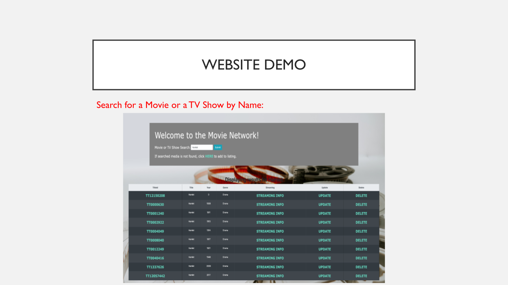

# tv_shows 
A tv shows/movie web page that focuses on MySQL database planning and management using data from 30+ data sources. Users can search for movie information, and create, update, and delete movies. The frontend is written by JSP and the backend is written by JDBC.

 
 
 
 
 
 
